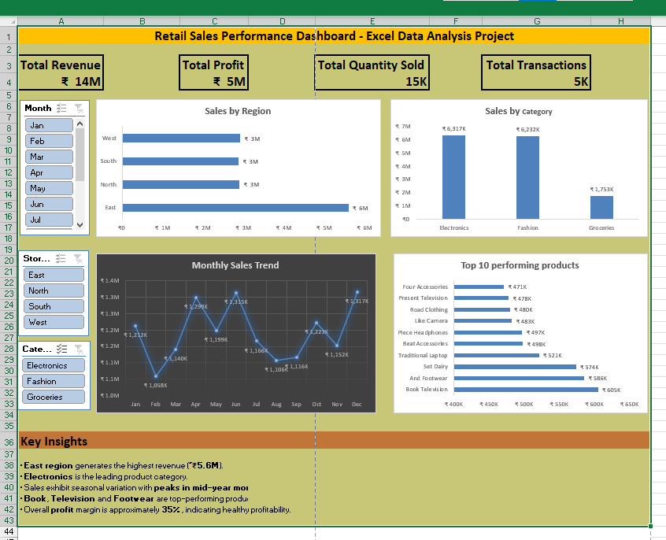
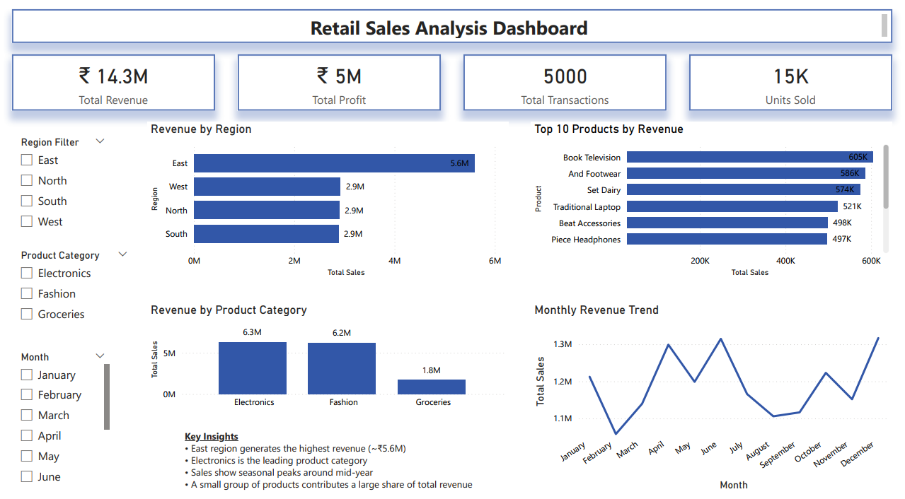

# Retail Sales Analysis (Excel • SQL • Power BI)

## Project Overview

This project demonstrates an end-to-end retail sales analysis workflow using **Excel, SQL, and Power BI**.

The goal of this project was to explore a retail dataset, prepare the data, perform analytical queries, and build interactive dashboards to uncover insights about sales performance, product trends, and regional revenue.

Instead of using only one tool, the same dataset was analyzed using **multiple tools across the data analytics stack** to simulate how real-world analysts work with data.

The project includes:

* Data preparation and dashboard creation in **Excel**
* Data modeling and analysis using **SQL**
* Interactive visualization using **Power BI**

---

# Dataset Description

The dataset represents retail business transactions and contains four main tables.

| Dataset      | Description                              |
| ------------ | ---------------------------------------- |
| Customers    | Customer demographic information         |
| Products     | Product details including price and cost |
| Stores       | Store location and region                |
| Transactions | Individual sales transactions            |

### Dataset Summary

| Metric       | Value |
| ------------ | ----- |
| Transactions | 5,000 |
| Customers    | 200   |
| Products     | 50    |
| Stores       | 5     |

---

# Stage 1 — Excel Analysis

## Objective

Perform initial data preparation and build a dashboard using Microsoft Excel.

## Tasks Performed

* Combined multiple datasets into a **master sales table**
* Created calculated fields:

  * Revenue
  * Profit
  * Month
  * Year
* Used **Pivot Tables** to analyze sales data
* Built an interactive **Excel dashboard**

## Excel Dashboard Features

* KPI Cards

  * Total Revenue
  * Total Profit
  * Total Transactions
  * Units Sold

* Sales by Region

* Sales by Product Category

* Monthly Sales Trend

* Top Performing Products

Excel was used to understand the dataset structure and perform quick exploratory analysis.

---

# Stage 2 — SQL Data Modeling & Analysis

## Objective

Store the dataset in a relational database and perform structured analysis using SQL.

The dataset was imported into **MySQL** and organized into normalized tables.

### Database Tables

```
customers
products
stores
transactions
```

SQL joins were used to combine these tables into an analytical dataset.

### Example SQL Query

```sql
SELECT 
    t.transaction_id,
    t.transaction_date,
    MONTH(t.transaction_date) AS month,
    p.ProductName,
    p.Category,
    s.Region,
    t.quantity,
    p.UnitPrice,
    p.CostPrice,
    t.discount,
    (t.quantity * p.UnitPrice * (1 - t.discount)) AS revenue,
    ((p.UnitPrice - p.CostPrice) * t.quantity) AS profit
FROM transactions t
JOIN products p ON t.product_id = p.ProductID
JOIN stores s ON t.store_id = s.StoreID;
```

This query created an **analytical dataset** used later in Power BI.

---

# Stage 3 — Power BI Dashboard

## Objective

Create an interactive dashboard to visualize sales performance.

The SQL analytical dataset was connected to **Power BI**.

### Dashboard Components

KPIs

* Total Revenue
* Total Profit
* Total Transactions
* Units Sold

Visualizations

* Revenue by Region
* Revenue by Product Category
* Monthly Revenue Trend
* Top 10 Products by Revenue

Filters

* Region
* Product Category
* Month

These filters allow users to interactively explore sales performance.

---

# Key Insights

The analysis revealed several important business insights:

* The **East region generates the highest revenue (~₹5.6M)**.
* **Electronics is the leading product category**.
* Sales show **seasonal trends with peaks during mid-year months**.
* A small group of products contributes a **large share of total revenue**.

These insights demonstrate how data visualization can support business decision-making.

---

# Tools Used

| Tool     | Purpose                                   |
| -------- | ----------------------------------------- |
| Excel    | Data cleaning and exploratory analysis    |
| MySQL    | Database storage and SQL querying         |
| Power BI | Interactive dashboard creation            |
| GitHub   | Project documentation and version control |

---

# Project Structure

```
datasets
│
├ customers.csv
├ products.csv
├ stores.csv
└ transactions.csv

excel
│
└ Retail_Sales_Analysis_Excel_Project.xlsx

sql
│
└ retail_sales_analysis.sql

power-bi
│
└ retail_sales_dashboard.pbix

images
│
├ excel_dashboard.png
└ powerbi_dashboard.png
```

---

# Dashboard Preview

### Excel Dashboard



### Power BI Dashboard



---

# Learning Outcomes

This project helped me strengthen my understanding of:

* Data cleaning and preparation
* SQL joins and analytical queries
* Dashboard design and visualization
* Data storytelling
* End-to-end analytics workflow

It also demonstrates how the same dataset can be analyzed using multiple tools across the analytics stack.

---

# Author

**Salahuddin K M**
Aspiring Data Analyst focused on building practical projects using **Excel, SQL, Power BI, and Python**.
